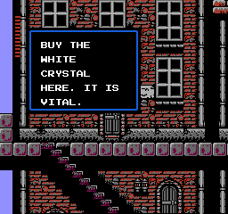
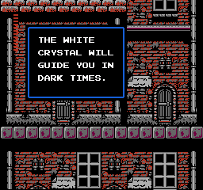
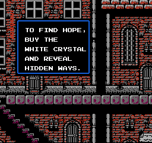

# Simon's Text

Simon's Text is a proof-of-concept project which generates and replaces dialog of the classic NES game Simon's Quest with infinite text generated from ChatGPT **in real time**. So far, only the 1st town of Jova is completed. This was inspired by [a talk Neal Stephenson had about some AI NPCs.](https://youtu.be/6ip3E-HuabE?si=cA7PVWm5Toykc3wd)

  

## Prerequisites

Before getting started with Simon's Text, make sure you have the following dependencies installed:

- [Bun](https://bun.sh/) to run the project
- The latest Mesen Emulator
- LuaSocket library for Lua
- Simon's Quest NES ROM

You will also need an working OpenAI api account with a project key. Details can be found here: 
Documentation: [OpenAI API Access](https://help.openai.com/en/articles/7039783-how-can-i-access-the-chatgpt-api)

## Installation

To install Simon's Text, follow these steps:

1. Clone the repository to your local machine.
2. Install Bun(https://bun.sh/)
3. Install LuaSocket; try LuaRocks! If you're on Windows, [you may need the precompiled version.](https://github.com/alain-riedinger/luasocket/releases). If so, unzip this into a folder named 'lua' inside of your Mesen directory.
4. Obtain a copy of a CLEAN Simon's Quest NES ROM somehow (don't tell me how you did it).

## Usage

To use Simon's Text, follow these instructions:

1. Add your api key to a `.env` file in the root
2. Run the server with `npm run start`
3. Launch the Mesen Emulator.
4. Load the Simon's Quest NES ROM.
5. Open the script window and load `dialog-overwrite-mesen.lua` NOTE: you will need to enable OS Functions and network access under settings, along with increasing max script execution time to around 5 seconds. 
6. Enjoy the game with dynamically generated text!

# How it works
The Bun server does the heavy lifting for both text generation AND various runtime rom adjustments which allow for text manipulation. When a dialog is triggered, the lua script reads the actor ID at 0x007F to see if there's a defined prompt in `prompts.ts`; if so, it will overwrite 2 intructions to redirect the dialog text pointer to the extra space at the end of the rom dialog text definitions. It will then call the Bun server to see if cached dialog for the specific `actorID` exists; if so, it will return a line of cached dialog, but will make a call to ChatGPT if it doesn't. The dialog is parsed and encoded into bytes, then returned to the LUA script, which subsequently writes the returned dialog to that extra space in the rom we discussed earlier. Then, the text is displayed for the player's enjoyment.

## Prompts
Prompts.ts contains prompts for each of the actors in the game's first town of Jova. The actor IDs are used as keys for this object. Feel free to peruse them and modify them, or create your own!

## Contributing

Anything is fine! I plan on finishing up the prompts, so maybe some contributions to that could help. Also, the dialog often flows out of the bounds of the textbox; I'll fix that someday if someone else doesn't.

## Special Thanks
Got a ton of help from the folks over at the [Castlevania 2 Randomizer Project](https://github.com/kaelari/cv2r/wiki); it would've taken a LOT longer to do it without them.

## License

Simon's Text is licensed under the [MIT License](https://opensource.org/licenses/MIT).
